# Live demo detail

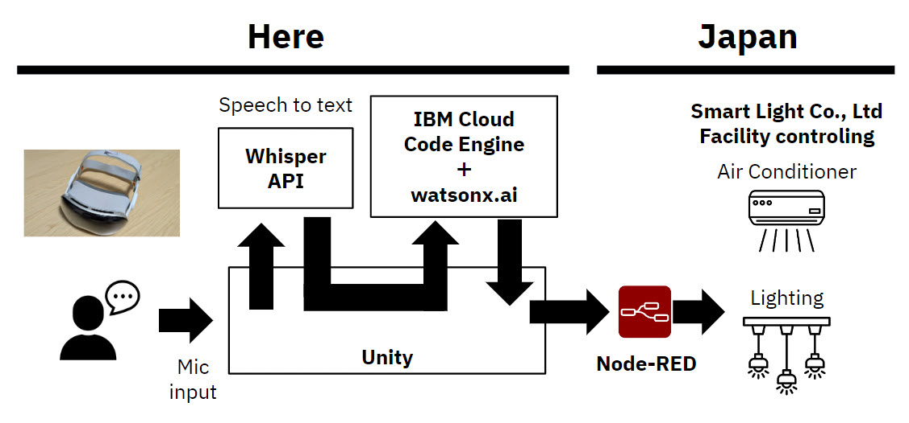

We will explain the detail of my live demo architecture.

## Today version is Vision Pro (xR) + voice + watsonx.ai + facility control

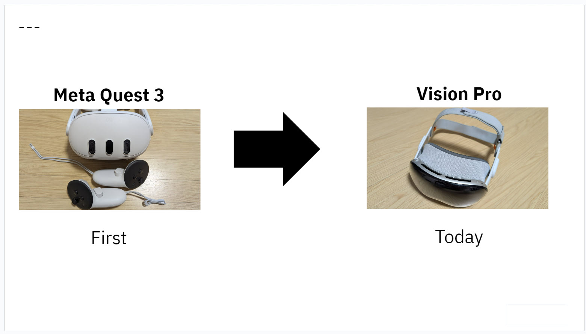

## Demo flow

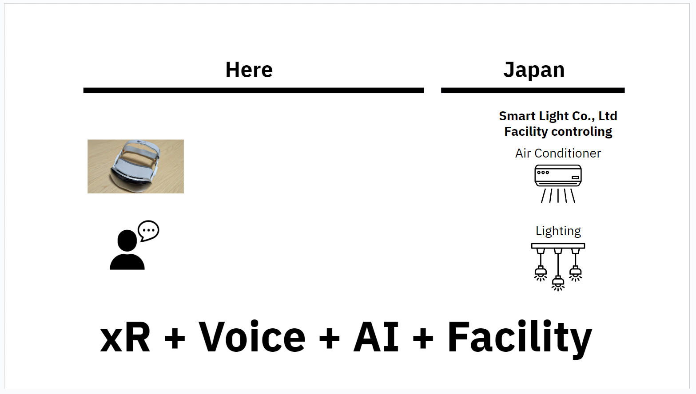

.

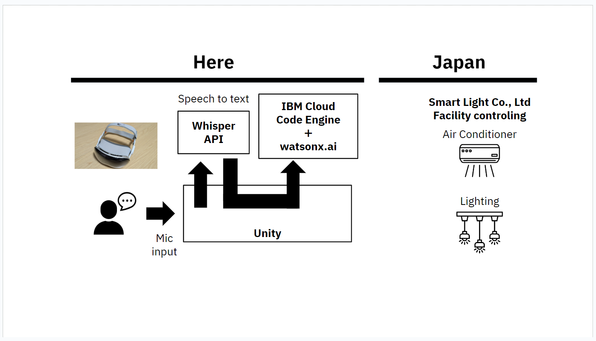

.

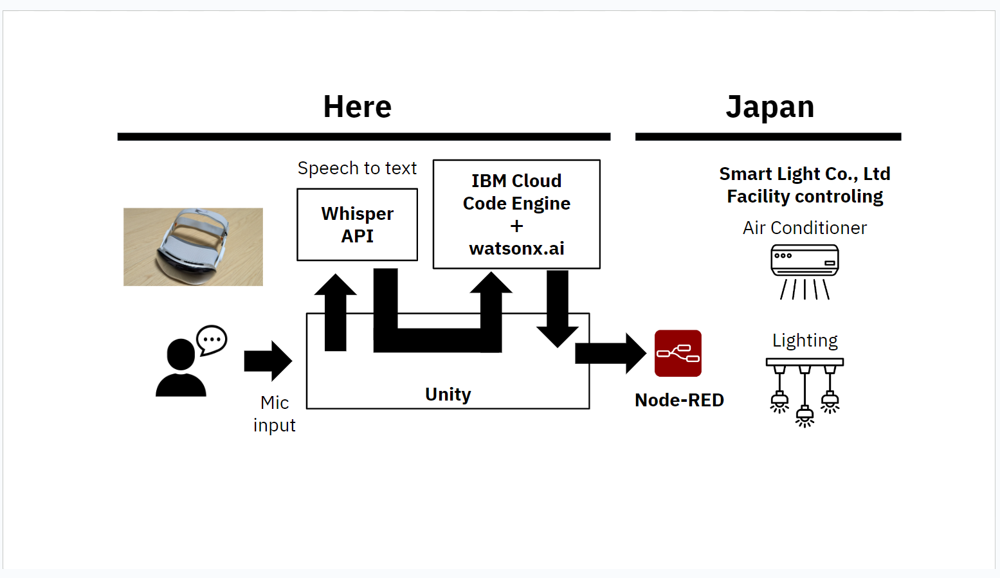

.

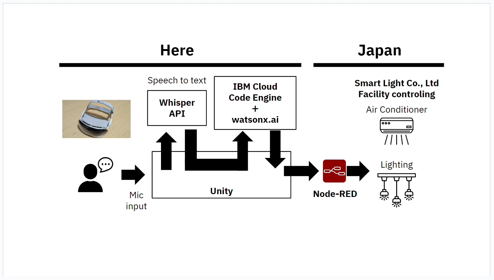

## demo room in Japan :)

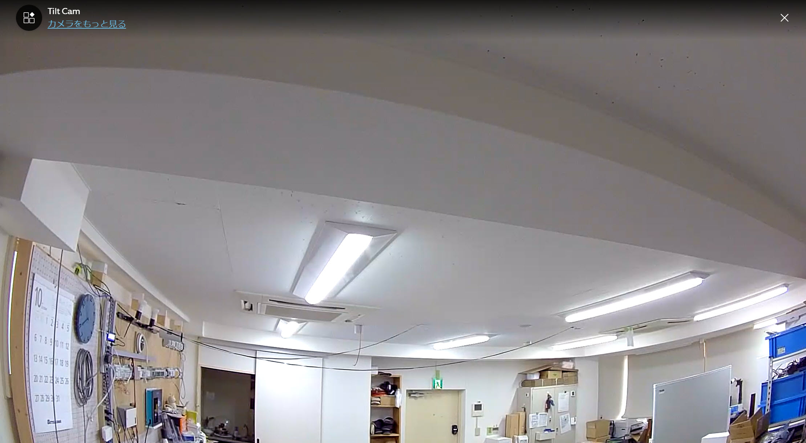

.

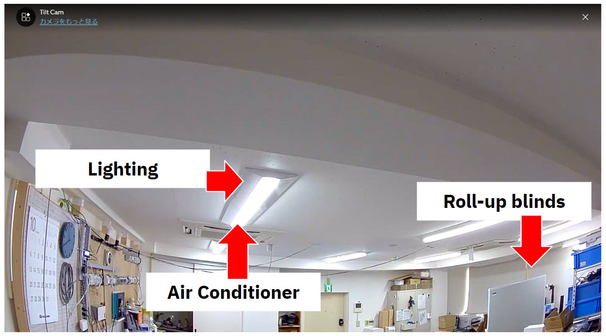

## Demo steps

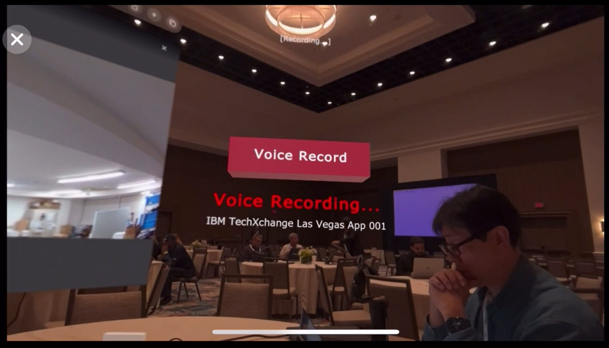

.

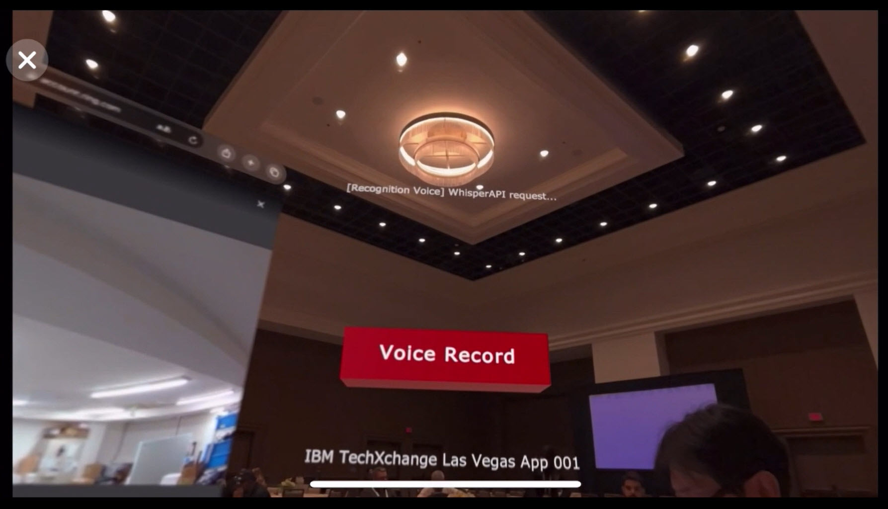

.

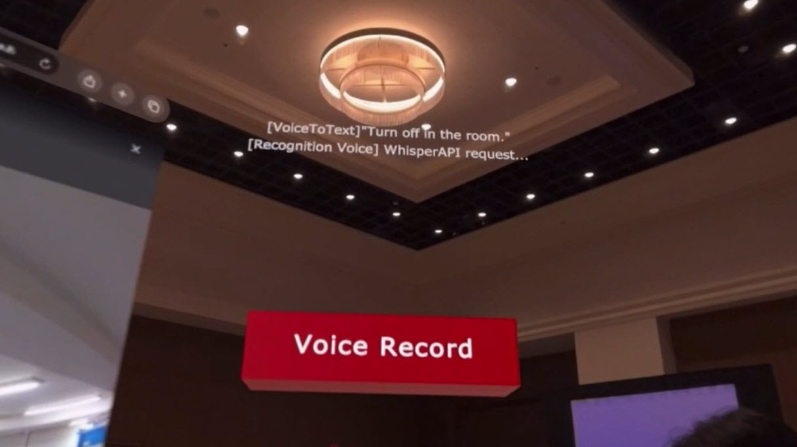

.

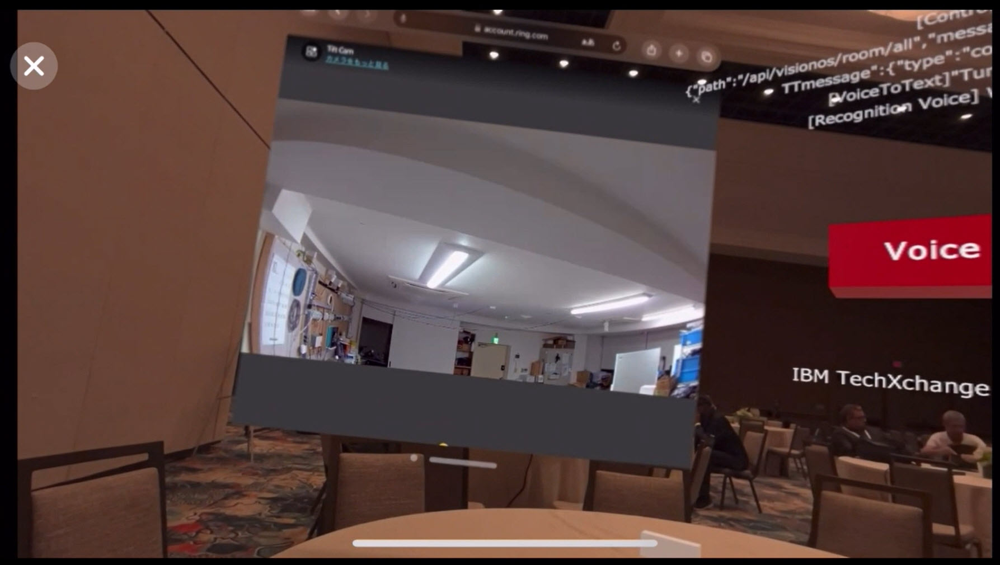

.

