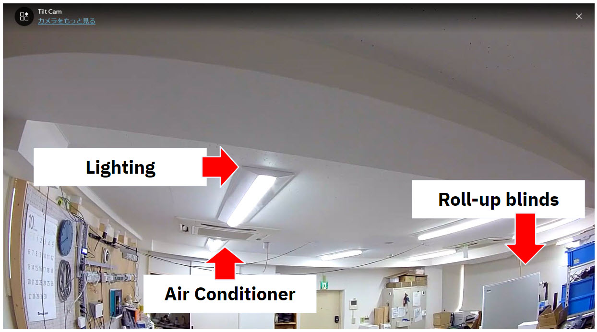
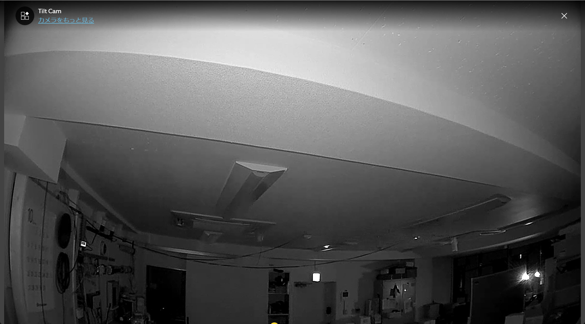

# Live demo detail

We will explain the detail of my live demo architecture.

## Today version is Vision Pro (xR) + voice + watsonx.ai + facility control

## demo room in Japan :)

It's Our japan demo room "on".

It's facilities information.

- Lighting -> on
- Roll-up blineds -> down(close)
- Air Conditioner -> on

It's Our japan demo room "off".

- Lighting -> off
- Roll-up blineds -> up(open)
- Air Conditioner -> off

## Demo flow

.

.

.

.

.

.

.

