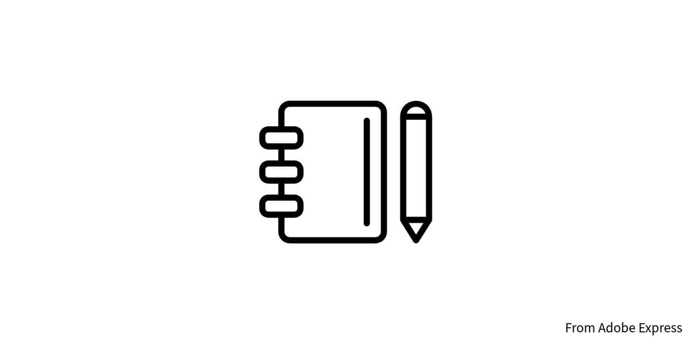

# Code Engine dtail



We will explain the detail of my CodeEngine.

## Code Engine Node.js code

```js
const express = require('express');
const axios = require('axios');
const mqtt = require("async-mqtt");
const app = express();

const WATSONX_API_KEY = 'WATSONX_API_KEY';
const WATSONX_PROJECT_ID = 'WATSONX_PROJECT_ID';

const getAccessToken = async () => {

  const params = new URLSearchParams()
  params.append('grant_type', 'urn:ibm:params:oauth:grant-type:apikey');
  params.append('apikey', WATSONX_API_KEY);

  let response;
  try {
      response = await axios.request({
          method:'POST',
          url:'https://iam.cloud.ibm.com/identity/token',
          headers:{
              'Content-Type':'application/x-www-form-urlencoded',
              'Accept': 'application/json'
          },
          data:params
      });
  } catch(e) {
      console.log(e);
  }
  
  return response.data;
}

const askWatsonXAI = async (message, access_token) => {
  // console.log(`access_token : ${access_token}`);
  let configAI = {
      method:'POST',
      url:'https://jp-tok.ml.cloud.ibm.com/ml/v1/text/generation?version=2023-05-29',
      headers:{
          'Content-Type':'application/json',
          'Accept': 'application/json',
          'Authorization': `Bearer ${access_token}`
      },
      data:{
          input:`
照明制御のためのオンオフを制御するため、以下の内容から JSON オブジェクトだけ生成してください。

- JSON オブジェクトは message 値 のみで構成されます
- message 値は string 型です
- message 値は on ・ off ・ ng の文字列のみです
- 内容がオンの意味として認識したときに messeage 値は on になります。
- 内容がオフの意味として認識したときに messeage 値は off になります。
- 内容がオンかオフで認識されなかったときは messeage 値は ng になります。

以下が例です。

----
内容:
オン

JSON:
{"message":"on"}
----
内容:
オフ

JSON:
{"message":"off"}
----
内容:
on

JSON:
{"message":"on"}
----
内容:
off

JSON:
{"message":"off"}
----
内容:
今日はいい天気

JSON:
{"message":"ng"}
----
内容:
やっほーーーー

JSON:
{"message":"ng"}
----

それでは、上記のルールで回答ください。

内容 :
${message}

JSON:
`,
          parameters: {
            decoding_method: "greedy",
            max_new_tokens: 900,
            min_new_tokens: 0,
            stop_sequences: [],
            repetition_penalty: 1.05
          },
          model_id: "ibm/granite-8b-japanese",
          project_id: WATSONX_PROJECT_ID
      }
  };

  let response;

  try {
      response = await axios.request(configAI);
  } catch(e) {
      console.log(e);
  }

  return response.data;
}

app.use(express.static(__dirname + '/public'));

// bodyParser
app.use(express.json())
app.use(express.urlencoded({ extended: true }));

// version
const EXE_VERSION = "1.0.1";

app.get('/api/version', function (req, res) {
  console.log('---------------- /api/sample');
  res.json(
    {
      "path":"/api/version",
      "version":EXE_VERSION
    }
  );
});

app.get('/api/sample', function (req, res) {
  console.log('---------------- /api/sample');
  res.json(
    {
      "path":"/api/sample",
      "result":"OK"
    }
  );
});

app.post('/api/log', function (req, res) {
  console.log('---------------- /api/log');
  console.log(req.body);
  res.json(
    {
      "path":"/api/log",
      "result":"OK"
    }
  );
});

const getAIResult = async (message) => {
  console.log(`message : ${message}`);

  const tokenData = await getAccessToken();

  const responseAIData = await askWatsonXAI(message,tokenData.access_token);
  // console.log(responseAIData);

  let answer = '';
  if(responseAIData){
    if(responseAIData.results){
      if(responseAIData.results.length > 0){
        if(responseAIData.results[0].generated_text != ''){
          answer = `${responseAIData.results[0].generated_text}`;
        }
      }
    }
  }

  return answer
}

app.get('/api/message', async function (req, res) {
  console.log('---------------- GET /api/message');

  const _message = req.query.message;
  const answer = await getAIResult(_message);

  res.json(
    {
      "path":"/api/message",
      "message":answer
    }
  );
});

app.post('/api/message', async function (req, res) {
  console.log('---------------- POST /api/message');
  // console.log(req.body);
  const _message = req.body.message;
  const answer = await getAIResult(_message);

  res.json(
    {
      "path":"/api/message",
      "message":answer
    }
  );
});

app.post('/api/visionos/light/simple', async function (req, res) {
  
  const topic = 'ibm/room/ZAyjeJX1Yrnd/control_light_simple';
  const path = '/api/visionos/light/simple';

  console.log(`---------------- POST ${path}`);

  await sendOnOff(req, res, path, topic);

});

app.post('/api/visionos/light/all', async function (req, res) {
  
  const topic = 'ibm/room/ZAyjeJX1Yrnd/control_light';
  const path = '/api/visionos/light/all';

  console.log(`---------------- POST ${path}`);

  await sendOnOff(req, res, path, topic);

});

app.post('/api/visionos/room/all', async function (req, res) {
  
  const topic = 'ibm/room/ZAyjeJX1Yrnd/control_all';
  const path = '/api/visionos/room/all';

  console.log(`---------------- POST ${path}`);

  await sendOnOff(req, res, path, topic);

});


const sendOnOff = async (_req, _res, _path, _topic) =>{

  const _message = _req.body.message;
  const _answer = await getAIResult(_message);
  
  console.log(`_answer ${_answer}`);

  const client = mqtt.connect('mqtt://********************', {
    username: 'username',
    password: 'password',
    port:18953,
    keepalive: 60,
    clientId: 'ibm-codeengine-client-' + Math.floor( 100000 + Math.random() * 10000 )
  });
  
  let _sendMQTTmessage = {};
  if(_answer === '{"message":"on"}' ){
    _sendMQTTmessage = {
      "type":"control",
      "message":"on"
    };
    await client.publish(_topic, JSON.stringify(_sendMQTTmessage));
    console.log(`publish OK! ${JSON.stringify(_sendMQTTmessage)}`);
  } else if(_answer === '{"message":"off"}' ){
    _sendMQTTmessage = {
      "type":"control",
      "message":"off"
    };
    await client.publish(_topic, JSON.stringify(_sendMQTTmessage));
    console.log(`publish OK! ${JSON.stringify(_sendMQTTmessage)}`);
  }

  await client.end();

  _res.json(
    {
      "path":_path,
      "message":_answer,
      "sendMQTTmessage":_sendMQTTmessage
    }
  );
};

app.post('/api/config', function (req, res) {
  console.log('---------------- /api/config');
  console.log(req.body);
  res.json({
    "path":"/api/config",
    "urlAIMessageAPI":"urlAIMessageAPI",
    "urlFacilityAirConditionerAPI":"urlFacilityAirConditionerAPI",
    "urlFacilityLightingAPI":"urlFacilityLightingAPI"
  });
});

app.listen(process.env.PORT || 8080, () => {
  console.log("server start!");
  console.log(`app listening at http://localhost:${process.env.PORT || 8080}`)
})
```